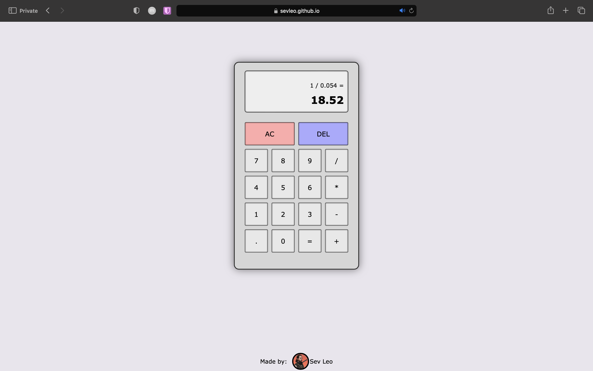

# Calculator

JavaScript mplementation of calculator supporting basic operations: addition, subtraction, division, and multiplication. 
- Supports decimals and negatives
- Supports keyboard entry

## Table of Contents

- [Demo](#demo)
- [How to use](#how-to-use)
- [Technologies](#technologies)
- [Contributing](#contributing)
- [License](#license)

## Demo

You can view the project at [Calculator Demo](https://sevleo.github.io/calculator/).

## Technologies

- Vanilla JS
- CSS
- HTML

## Contributing

 Contributions are welcome! If you'd like to contribute to this project, please follow these guidelines:

 1. Fork the repository.
 2. Create a new branch for your feature or bug fix.
 3. Make your changes and commit them.
 4. Push your changes to your fork.
 5. Create a pull request.

## License

 This project is licensed under the [MIT LICENSE](./LICENSE)